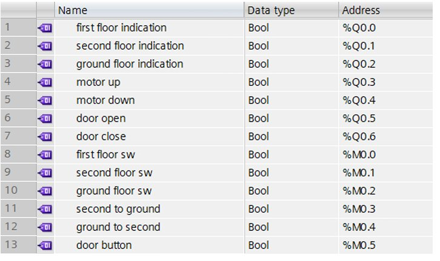
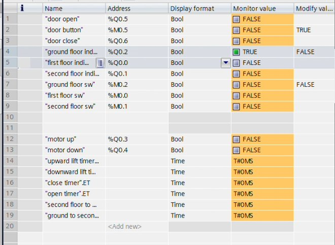
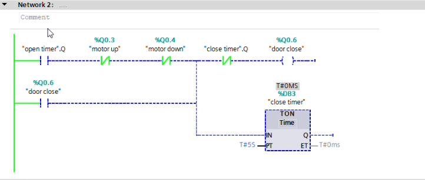
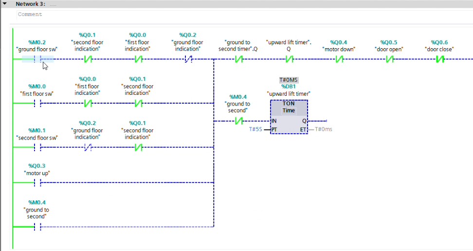

# 🏢 PLC Elevator System — Siemens TIA Portal V20

A **3-floor elevator control system** programmed using **Ladder Logic** in **Siemens TIA Portal V20**

The system automates elevator movement, floor selection, door operation, and safety interlocks using a Programmable Logic Controller (PLC), demonstrating real-world industrial automation concepts.

---

## 📹 Demo Video

[](YOUR_YOUTUBE_LINK_HERE)

> The demo video shows the full simulation running in TIA Portal — floor calls, motor direction, door operation, and live tag monitoring in action.

---

## 📌 Overview

This project implements a complete PLC-based elevator controller for **Ground Floor, First Floor, and Second Floor** with:

- **Floor call handling** — floor switches send requests to the PLC
- **Direction logic** — PLC determines up/down movement based on current floor vs target floor
- **Floor switch feedback** — memory bit switches confirm elevator position at each floor
- **Automatic door control** — doors open on arrival, hold via open timer, then close automatically
- **Safety interlocks** — door button interlock prevents movement while doors are open
- **Motor direction control** — upward and downward motor outputs with separate travel timers

---

## ✨ Features

- 3-floor elevator simulation in TIA Portal V20
- Ladder Diagram (LD) programming — IEC 61131-3 standard
- Upward (`motor up`) and downward (`motor down`) direction control
- Floor position tracking via memory bits (`ground floor sw`, `first floor sw`, `second floor sw`)
- Direction flags — `second to ground` and `ground to second` for travel path logic
- Timer-controlled door open/close sequence
- Separate travel timers — `upward lift timer` and `downward lift timer`
- `second floor to` and `ground to second` transition timers
- `door button` memory bit interlock
- Floor indicator lamps — ground, first, and second floor indication outputs

---

## 📸 Screenshots

| Tag table | Watch table |
|:------------:|:-----------:|
|  |  |

| ladder diagram N1 |
|:------------:|
|  |


| ladder diagram N2 |
|:------------:|
|  |


| ladder diagram N3 |
|:------------:|
|  |

---

## 🛠️ Technologies Used

### Software

| Tool | Version | Purpose |
|------|---------|---------|
| Siemens TIA Portal | **V20** | PLC programming and project environment |
| PLCSIM | **V20** | Software simulation — no physical PLC needed |

### PLC Programming

- **Language:** Ladder Diagram (LD) — IEC 61131-3
- **Target PLC:** Siemens S7-1200 / S7-1500 (simulated via PLCSIM V20)

### Hardware Components (Physical / Simulated)

| Component | Purpose |
|-----------|---------|
| PLC (S7-1200/1500) | Core controller |
| Floor Call Switches ×3 | Ground / First / Second floor requests |
| Door Button | Manual door open request |
| DC Motor / Contactor | Drives elevator up or down |
| Door Actuator | Opens and closes cabin doors |
| Floor Indicator Lamps ×3 | Ground / First / Second floor indication |

---

## 🏗️ System Architecture

```
Floor Switches (Ground / First / Second)   ──→   PLC Memory Bits (M)
Door Button

              ↓
      Siemens S7-1200
      Ladder Logic (OB1)
      TIA Portal V20
              ↓

Motor Up (%Q0.3)                           ──→   PLC Digital Outputs (Q)
Motor Down (%Q0.4)
Door Open (%Q0.5)
Door Close (%Q0.6)
Floor Indicator Lamps (%Q0.0 / Q0.1 / Q0.2)
```

---

## 🔌 I/O Tag Reference

### Digital Outputs (Q)

| Tag Name | Address | Description |
|----------|---------|-------------|
| first floor indication | %Q0.0 | First floor position indicator lamp |
| second floor indication | %Q0.1 | Second floor position indicator lamp |
| ground floor indication | %Q0.2 | Ground floor position indicator lamp |
| motor up | %Q0.3 | Elevator motor — upward direction |
| motor down | %Q0.4 | Elevator motor — downward direction |
| door open | %Q0.5 | Door open actuator output |
| door close | %Q0.6 | Door close actuator output |

### Memory Bits (M) — Internal Flags

| Tag Name | Address | Description |
|----------|---------|-------------|
| first floor sw | %M0.0 | Elevator at first floor flag |
| second floor sw | %M0.1 | Elevator at second floor flag |
| ground floor sw | %M0.2 | Elevator at ground floor flag |
| second to ground | %M0.3 | Direction flag — travelling second → ground |
| ground to second | %M0.4 | Direction flag — travelling ground → second |
| door button | %M0.5 | Door open request / door interlock bit |

### Timers (used in ladder logic)

| Tag Name | Type | Description |
|----------|------|-------------|
| upward lift timer | TON | Controls upward travel duration |
| downward lift timer | TON | Controls downward travel duration |
| close timer | TON | Delay before door closes |
| open timer | TON | Duration door remains open |
| second floor to ground | TON | Transition timer — second floor to ground travel |
| ground to second floor | TON | Transition timer — ground to second travel |

---

## 📁 Repository Structure

```
PLC-Elevator-System/
│
├── README.md
├── .gitignore
│
├── TIA_Portal_Project/
│   ├── Elevator_System.prx          ← Main TIA Portal V20 project (open this)
│   └── Midway_Checkpoint.prx        ← Intermediate saved version
│
├── Ladder_Diagram/
│   └── (add exported ladder diagram screenshots or PDF here)
│
├── Images/
│   └── (add TIA Portal screenshots here)
│
└── Docs/
    └── IO_Tag_Reference.md          ← Complete I/O tag and address table
```

---

## ⚙️ How to Open the Project

### Requirements

- **Siemens TIA Portal V20** (student/trial license available from Siemens)
- **PLCSIM V20** for software simulation (no physical PLC required)

> ⚠️ `.prx` files are proprietary Siemens TIA Portal archives. They **cannot** be opened in older versions like V17 or V19 — you must use **V20 or later**.

### Steps

1. Open **Siemens TIA Portal V20**
2. Click **"Open existing project"**
3. Navigate to `TIA_Portal_Project/`
4. Select `Elevator_System.prx` → click **Open**
5. In the Project tree expand **PLC_1 → Program blocks → Main [OB1]**
6. Double-click to view the ladder logic networks
7. To run simulation: **Online → Start simulation** (PLCSIM V20 must be running)
8. Open **Watch table** to monitor live tag values during simulation

---

## 🔄 System Workflow

```
System powered on
        ↓
Floor switch pressed (ground / first / second)
        ↓
PLC sets direction flag
(ground to second → motor up)
(second to ground → motor down)
        ↓
Door closed? → Motor activates
        ↓
Upward / downward lift timer runs
        ↓
Target floor switch (memory bit) sets
        ↓
Motor stops
        ↓
Door open output activates
→ Open timer starts
        ↓
Open timer expires
→ Close timer starts → Door closes
        ↓
Ready for next floor call
        ↓
Door button pressed at any time
→ door button (M0.5) set
→ Door opens, motor blocked
```

---

## 🔒 Safety Logic

| Feature | Implementation |
|---------|----------------|
| Door Interlock | `door button` (%M0.5) blocks motor rungs while door is open |
| Direction Interlock | `motor up` (%Q0.3) and `motor down` (%Q0.4) are mutually exclusive |
| Floor Position Tracking | Memory bits `ground floor sw`, `first floor sw`, `second floor sw` prevent re-triggering |
| Travel Timers | `upward lift timer` and `downward lift timer` limit motor run time per journey |

---

## 📚 Learning Outcomes

- PLC programming with Ladder Diagram (IEC 61131-3)
- Siemens TIA Portal V20 project structure and tag configuration
- Memory bit usage for internal state tracking
- TON timer sequencing for door and travel control
- Direction flag logic for multi-floor routing
- Motor direction control with mutual interlocking
- Live tag monitoring via TIA Portal Watch Table
- Safety interlock design in industrial ladder logic

---

## 🚀 Future Improvements

- [ ] Expand to 4+ floors
- [ ] HMI screen design in TIA Portal for live floor visualization
- [ ] Priority queue for multiple simultaneous floor calls
- [ ] Inside cabin call buttons separate from floor buttons
- [ ] Door obstruction detection with auto re-open
- [ ] Energy-saving idle mode
- [ ] Deploy on physical S7-1200 hardware

---

## 👤 Author

**Mayank Jain**  
IoT, Robotics and Automation Enthusiast

---

## 📄 License

This project is shared for educational and learning purposes.
